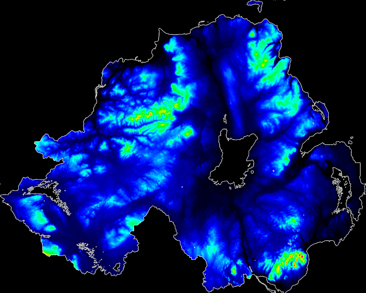
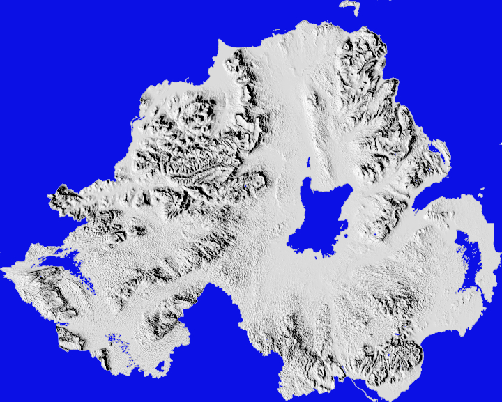

# topogra-py
Draw maps using publicly-available topography data

This repo contains a set of scripts for interpreting OSNI's 50m Digital Terrain Mapping topography data, available at https://www.opendatani.gov.uk/dataset/osni-open-data-50m-dtm.  This is a dataset of X and Y coordinates of Northern Ireland with associated heights for each coordinate, using ~50m x 50m chunks of land per set of coordinates.  The functions will pre-process this data (see below), use the Python Image Library (Pillow/PIL) to create an image to hold the data, and will then set the RGB values of each pixel to a colour dependent on the height.  In the current configuration blue is the lowest ground, and red/violet are the highest areas.  The functions currently *do not* take into account below-sea-level ground (this is set to a floor of "just above sea level").

The output of the script can be seen above.

# Functions

* def drawMap(dataFile, resolution=50, coordinateOffset=25):
  * Performs the basic map-drawing.  `dataFile` should be the location of the 50m DTM file, `resolution` is the resolution of the data (defaults to 50m because this was written for a 50m dataset).  `coordinateOffset` defaults to 25.  The default format of the DTM data is a bit funny, and needs some preprocessing.  Initially the X and Y coordinates seem to be metres from an unknown origin point.  They also don't start at zero, they start at 25.  One part of the data preprocessing is to boil them down to contiguous numbers in increments of 1, and the `coordinateOffset` parameter is subtracted from the data to help achieve this.  This helps to remap the data from X coordinates beginning at something like 180,025, 180,075, 180,125, 180,175 etc. to 0,1,2,3 etc..
  
* def remapData (dataList, resolution, offset):
  * This function, called by `drawMap`, carries out the rest of the data preprocessing, largely by finding the value of the smallest coordinate and subtracting that from all coordinates.  This converts the data from starting at ~180,000+ on the X axis to starting at 0.  A similar adjustment is applied to the Y axis data.  `dataList` should be a list of X or Y coordinates to remap.  `resolution` and `offset` are provided by `drawMap` and are explained in the description of that function.
  
* def getColour(value, scale, heightFloor = 1):
  * A crude function for scaling the colour of pixels by the associated height.  `value` is the height (in metres) which requires a colour, `scale` is currently an arbitrary number which the height is multiplied or divided by to make sure that the highest point fits within the RGB colour scale.  `heightFloor` is a cutoff: any pixels with a height in metres below this is set to this value.  This is currently used to stop pixels with negative heights (i.e. those below sea level) screwing up the colour scheme.  At a glance the NI data has a few pixels 1-2 metres below sea level and so they don't make a big difference, but this will probably need to be handled more elegantly if other datasets are ever used.  This function currently assigns colours from blue (low) to red/violet (high) in a linear manner.
  
* def border(image, rounds, border_colour=(255,255,255)):
  * When drawing the heightmap image, a lot of coastal pixels are very close to sea-level.  `getColour` can assign these very dim blue values, which makes it hard to distinguish these areas from the sea (which is black).  The `border` function draws a 1-pixel border around the terrain to make it much easier to distinguish land from the sea.  This works by testing every pixel to find those which are sea/with no terrain data (RGB = 0,0,0), checking the pixels above, below, left and right of this pixel, and if any of these are terrain (RGB > 0,0,0) then the sea-pixel is set to the `border_colour` (defaults to white).  `rounds` is the number of times to perform this, to enable a thicker, more-visible line to be drawn.  Please note, *any* pixels with no terrain data which are adjacent to terrain will have a border drawn, so this function will also draw borders around the inside of lakes, reservoirs, etc..
  
# Further fun!

* At some point I hope to update this to use the OSNI 10m resolution DTM data.  A quick examination shows some formatting differences, and the data are split across ~250 individual files, so I'm not certain this will run as part of the same script.
* You can pass the final image to other image processing programs to make some interesting variations on the basic heatmap-style image.  The image below was simply run through GIMP's Emboss function.  It might look a bit better without the border and with some more careful adjustment of the parameters, but it's something which genuinely looks really nice at a higher resolution.

